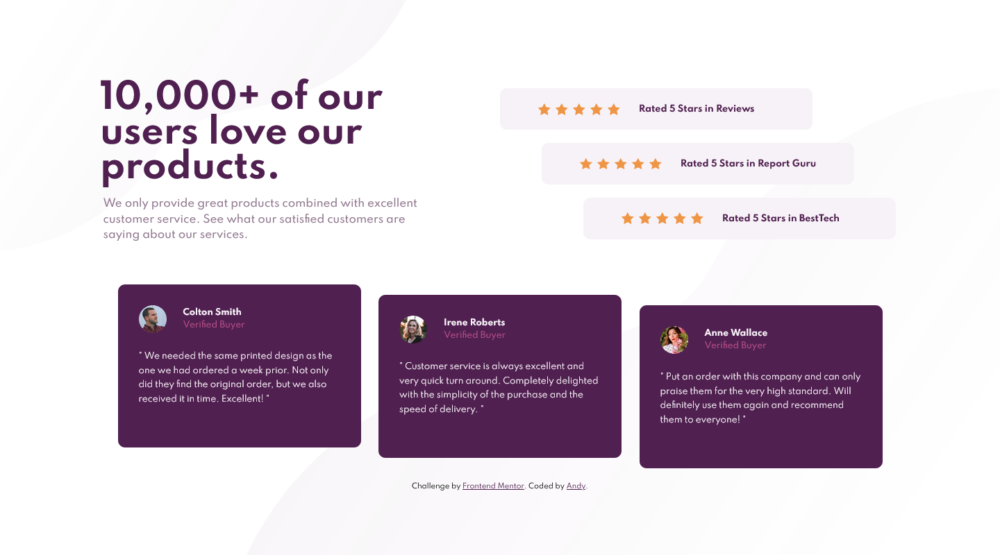
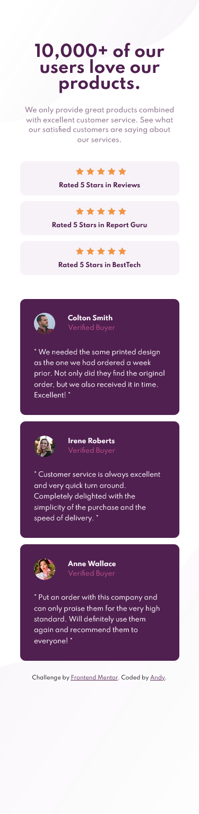

# Frontend Mentor - Social proof section solution

This is a solution to the [Social proof section challenge on Frontend Mentor](https://www.frontendmentor.io/challenges/social-proof-section-6e0qTv_bA). Frontend Mentor challenges help you improve your coding skills by building realistic projects.

## Table of contents

- [Overview](#overview)
  - [The challenge](#the-challenge)
  - [Screenshot](#screenshot)
  - [Links](#links)
- [My process](#my-process)
  - [Built with](#built-with)
- [Author](#author)

## Overview

This is my eighth challenge from [Front-end-mentor.io](https://www.frontendmentor.io/). It was to code and style an social proof section based on the design assets provided. (static **JPG** images)

### The challenge

Users should be able to:

- View the optimal layout for the section depending on their device's screen size

### Screenshot

### Links

- Solution URL: [GitHub Repo](https://github.com/AndyAshley/Social-Proof-Challenge)
- Live Site URL: [GitHub Pages](https://andyashley.github.io/Social-Proof-Challenge/)

### Built with

- Semantic HTML5 markup
- CSS custom properties
- CSS custom animations
- Flexbox
- Mobile-first workflow

## Author

- Frontend Mentor - [@yourusername](https://www.frontendmentor.io/profile/yourusername)
